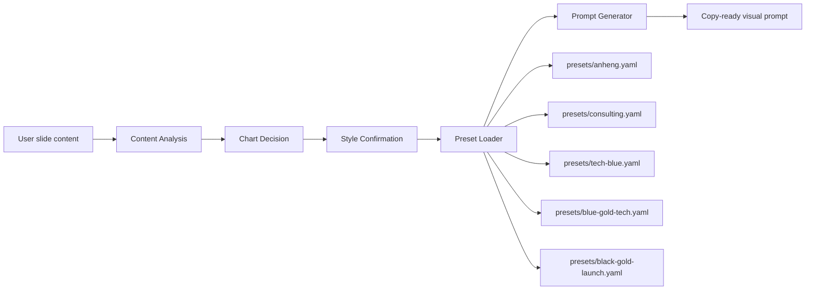
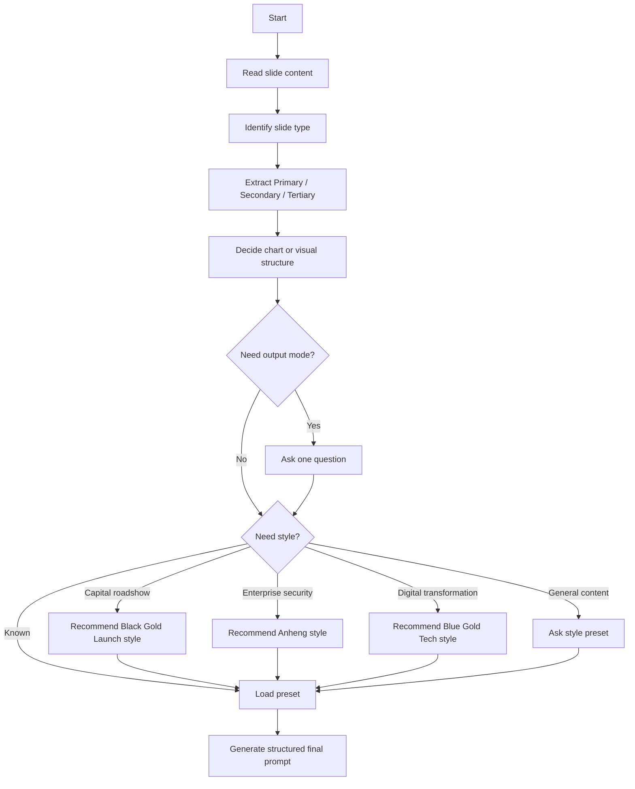

<p align="center">
  
</p>

<p align="center">
  <a href="./LICENSE"></a>
  
  
  
  
</p>

# ppt-viz

`ppt-viz` is a multi-turn skill for transforming slide content into presentation-ready visual generation prompts. It can also be invoked with the Chinese short name `PPT设计`.

It is not a PPT generator. It helps Claude analyze a slide's message, choose a justified chart or visual structure, confirm missing design constraints, load a style preset, and output a copy-ready final prompt for AI visual tools.

## Core Capabilities

- Multi-turn requirement clarification
- Information hierarchy analysis
- Chart decision engine
- Style presets
- Anheng enterprise cybersecurity style support
- Blue Gold Tech style for digital transformation and value-creation consulting pages
- Black Gold Launch style for financing proposals, investor roadshows, business plans, and premium launch decks
- Chinese and English output fields based on user language
- Bottom-image mode and finished-image mode

## Architecture



## Workflow



## Style Presets

| Preset | File | Best For |
|---|---|---|
| Anheng | `presets/anheng.yaml` | Cybersecurity, government-enterprise reports, SOC, AI security, enterprise security solutions |
| Consulting | `presets/consulting.yaml` | Business reports, executive decks, strategy pages, data-heavy slides |
| Tech Blue | `presets/tech-blue.yaml` | Blue technology launch visuals, AI safety events, cyber timelines, infrastructure narratives |
| Blue Gold Tech | `presets/blue-gold-tech.yaml` | Enterprise digital transformation, strategy reports, consulting proposals, capability models, value creation, transformation roadmaps |
| Black Gold Launch | `presets/black-gold-launch.yaml` | Financing proposals, business plans, investor roadshows, company introductions, market analysis, financial forecasts, premium launch decks |

If the user does not specify a style and the content is about financing, roadshows, business plans, project background, strategy planning, financial forecasts, fundraising plans, market analysis, commercial value, capital expression, company introductions, or premium business launches, the skill recommends Black Gold Launch style first.

If the user does not specify a style and the content is about cybersecurity, government-enterprise reporting, security launch events, SOC, attack-defense, data security, AI security, code audit security, or digital infrastructure, the skill recommends Anheng style first.

If the user does not specify a style and the content is about digital transformation, strategy planning, consulting reports, growth flywheels, capability systems, value creation, intelligent operations, enterprise upgrades, or business transformation, the skill recommends Blue Gold Tech style first.

When a slide matches capital roadshow themes and another domain theme, Black Gold Launch remains the first recommendation unless the user explicitly asks for another preset.

When a slide matches both enterprise security and digital transformation themes, Anheng remains the first recommendation unless the user explicitly asks for Blue Gold Tech or a blue-gold value style.

## Installation

```bash
npx skills add https://github.com/cici541/ppt-visual-prompt-designer
```

Repository: [cici541/ppt-visual-prompt-designer](https://github.com/cici541/ppt-visual-prompt-designer)

After installation, invoke the skill with `ppt-viz` or `PPT设计`.

## Example

### Input

```text
请你用这个技能，帮我做一页中国近20年网络安全发展史的PPT
```

### First Response

```markdown
## 初步分析
- 页面类型: 时间线 / 行业发展史页
- 核心信息: 中国网络安全近20年从基础合规建设，逐步走向法律体系化、数据安全治理、关基保护、AI安全与数字基础设施安全的综合治理阶段。
- 主要层级: 2006-2026 中国网络安全发展的阶段演进主线。
- 次要层级: 等保制度、网络安全法、等保2.0、数据安全法、个人信息保护法、关基保护、生成式 AI 安全治理等关键节点。
- 三级层级: 云安全、零信任、攻防演练、SOC、安全运营、数据出境、网络数据安全治理等补充关键词。
- 图表决策: 不使用传统统计图表；更适合横向时间线 / 阶段演进路线图。
- 输出模式: 待确认。

## 需要确认
输出模式选无文字底图，还是带标题和正文的成品图？
```

### Final Output Excerpt

```markdown
## 页面类型
时间线页 / 行业发展史页

## 核心信息
中国近20年网络安全发展，主线是从“等级保护与基础合规”走向“法律体系化、数据安全治理、关基保护、AI安全与数字基础设施安全”的政企级安全治理体系。

## 图表决策
- 决策: 不使用传统统计图表。
- 理由: 内容是历史阶段演进，不是数量比较或趋势数据。
- 图表/结构类型: 横向时间线 + 阶段分组路线图。

## 风格定义
- 风格预设: 政企网络安全风格。
- 视觉风格: 专业、稳重、干净、企业级、政策汇报感。

## 输出模式
成品图模式。包含标题、阶段标题、年份、关键节点文字和简短说明。

## 最终画面提示词
生成一张 16:9 政企网络安全汇报风格 PPT 成品页，主题为“中国近20年网络安全发展史”。整体视觉专业、稳重、科技感克制，采用深蓝、政务蓝、湖蓝、白色和深灰为主色，少量红色仅用于关键法规或风险治理节点强调。页面顶部设置深蓝色标题栏，左侧放置白色加粗标题“中国近20年网络安全发展史”，右侧可放小号章节信息“2006-2026｜从合规建设到数字安全治理”。正文区域使用纯白或极浅蓝背景，保持充足留白和严格网格对齐。画面中央设计一条横向发展时间线，从左到右分为五个阶段：制度起步、国家战略、法律体系、数据与关基保护、AI与数字基础设施安全。
```

## Repository Structure

```text
ppt-visual-prompt-designer/
├── SKILL.md
├── README.md
├── LICENSE
├── CHANGELOG.md
├── .gitignore
├── examples/
│   ├── cover-slide.md
│   ├── timeline-slide.md
│   └── data-slide.md
├── presets/
│   ├── anheng.yaml
│   ├── black-gold-launch.yaml
│   ├── blue-gold-tech.yaml
│   ├── consulting.yaml
│   └── tech-blue.yaml
└── tests/
    └── eval_cases.md
```

## License

MIT License. See [LICENSE](./LICENSE).
